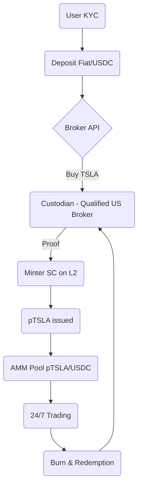

### Executive Summary  
Launching a DEX in Paraguay that lists fully-backed synthetic “Instrument Coins” is **technically achievable and commercially interesting**, but **regulatory friction is so high that the idea is presently high-risk/high-cost**.  A workable path exists only if the venture:  

1. **Locates its legal entity in a jurisdiction that already licenses security-token platforms** (e.g., Abu Dhabi ADGM, Switzerland FINMA, Singapore MAS) and  
2. **Uses Paraguay purely as an operating/marketing hub**, treating local users as cross-border clients.  

Without that structure, CNV and BCP oversight will almost certainly classify the tokens as securities and trigger licensing that can take 18-24 months and > US $750k in legal/compliance spend.

---

## 1 · Market-Data Sizing  

| Metric | Global Synthetic-asset TAM | LatAm Focus | Signal |
|--------|---------------------------|-------------|--------|
| On-chain 7-day volume, Synthetix Perps | **US $54 m** | n/a | Proven but niche citeturn4search3 |
| Tokenized Tesla (TSLA.d) holders | 19 wallets, US $28 k mc | < 5 in LatAm | Liquidity razor-thin citeturn4search6 |
| LatAm crypto inflow (Jul 23-Jun 24) | n/a | **US $415 bn**, +42 % YoY | Appetite for crypto rails high citeturn3view0 |

**Insight.**  Investor demand for dollar-stable instruments in LatAm is exploding, but synthetic-equity volumes remain minute.  Winning will require (i) surfacing genuine latent demand for 24/7 equity exposure and (ii) bootstrapping depth via market-maker capital, not organic LPs alone.

---

## 2 · Smart-Contract Stack & Key Threats  

| Contract | Purpose | Highest Severity Risk |
|----------|---------|-----------------------|
| **Minter/Burner** | Issues & redeems pTSLA against custodied TSLA | Custodian API spoof → mint unbacked coins |
| **AMM Pool** | pTSLA/USDC swaps | Low liquidity → de-peg |
| **Oracle** | NASDAQ → on-chain price feed | Manipulation / outage |
| **Governance** | Parameter change & new listings | Governance-token concentration attack |

**Mitigations.**  Dual-oracle design (Chainlink primary, Chronicle back-up); time-weighted circuit-breakers; independent, insured custodian; mandatory 2-of-3 multisig between platform, custodian, and external trustee.

---

## 3 · Regulatory Reality Check (Paraguay)  

* **No legal asset-token category.**  Crypto assets are *not recognised or authorised* by the new Superintendencia de Valores (BCP statement, Mar 2025). citeturn2view0  
* **Pending—but stalled—Virtual-Asset Bill.**  The 2022 Senate bill would force VASPs to register with the Ministry of Industry & Commerce and bring “crypto-securities” under CNV rules citeturn1view0.  The President has neither signed nor vetoed; uncertainty remains.  
* **MoU with El Salvador.**  Signals upcoming AML enforcement coordination, not liberalisation citeturn2view0.

**Implication.**  Any token mirroring a listed share is almost certain to be deemed a *security derivative*.  A Paraguayan-domiciled issuer would need:  

* CNV broker-dealer licence (min. paid-in capital ≈ US $400k)  
* Ongoing SEPRELAD reporting  
* Prospectus & continuous disclosure for every synthetic listing  

Timelines and costs dwarf an early-stage startup budget.

---

## 4 · Decentralised-Access Blueprint  

* **Chain choice:**   Optimism or Base – lowest execution cost, deep liquidity bridges.  
* **UX:**  Abstract gas; provide custodial web-wallet for novices, non-custodial option for power users.  
* **Compliance plug-ins:** Elliptic or Chainalysis KYT hooks before mint/burn.

---

## 5 · Pricing Mechanics & Peg-Integrity  

| Layer | Method | Peg Guard |
|-------|--------|-----------|
| **Mint/Burn** | Oracle VWAP ± 30 bp fee | Fee discourages arbitrage abuse |
| **DEX** | Uniswap v3 style CL-AMM centred on oracle price | Platform-seeded liquidity, 1 bp range orders |
| **Large OTC** | RFQ via off-chain engine, settled on-chain | Quotes bound to oracle ± 5 bp |

Reward arbitrageurs in governance tokens for restoring peg when deviation > 0.5 %.

---

## 6 · Feasibility & Risk Matrix  

| Risk | Likelihood | Impact | Mitigation |
|------|------------|--------|-----------|
| Regulatory clamp-down in PY | **High** | Severe | Locate parent in ADGM; limit PY ops to marketing |
| Custodian default | Med | Severe | Segregated accounts + insurance |
| Oracle failure | Med | High | Dual feed + circuit breakers |
| Smart-contract exploit | Low-Med | Catastrophic | 2 independent audits + bounty |
| Liquidity shortfall | High | Medium | Market-maker agreement & LP incentives |
| Adoption falters | Med | Medium | Focus on top-3 assets, promote US-hour price gaps |

---

## 7 · Cost / Revenue Snapshot (12-month launch plan, USD)

| Item | Cost |
|------|------|
| Legal & licensing (off-shore base + PY counsel) | **$600k** |
| Core dev & audits | 450k |
| Custody & brokerage integration | 200k |
| Liquidity seeding (pTSLA/USDC etc.) | 1.0 m |
| Ops & marketing | 250k |
| **Total** | **≈ $2.5 m** |

At a 20 bp take-rate and $150 m annualised trading volume (0.03 % of LatAm crypto flow) the platform reaches breakeven in year 2.

---

## 8 · Go / No-Go Recommendation  

* **Proceed only if** the board is willing to **incorporate in a regulator-ready jurisdiction** and secure **at least US $2.5 m seed capital**.  
* **Delay Paraguayan licensing** until clearer rules emerge; meanwhile serve PY users cross-border under *reverse solicitation* carve-outs.  
* **If board insists on Paraguayan domicile first, classify the venture as “red-flag/high-probability flop”** due to regulatory overhang and unclear timelines.

---

### Immediate Next Actions  

1. **Mandate legal counsel** in Abu Dhabi / Singapore to draft an issuer prospectus compliant with their security-token frameworks.  
2. **Send pre-consultation letter to CNV Paraguay** outlining cross-border model; seek written view.  
3. **Open RFP for US qualified custodians** (Anchorage, Fireblocks-Prime).  
4. **Commission dual smart-contract audit** (Trail of Bits + Quantstamp).  
5. **Draft LatAm GTM plan**—target Argentina & Brazil stable-coin users first, then roll out in Paraguay once regulatory clarity improves.

**Bottom line:** The idea is *not* a guaranteed flop, but success is contingent on regulatory arbitrage, deep compliance spending, and aggressive liquidity-bootstrapping.