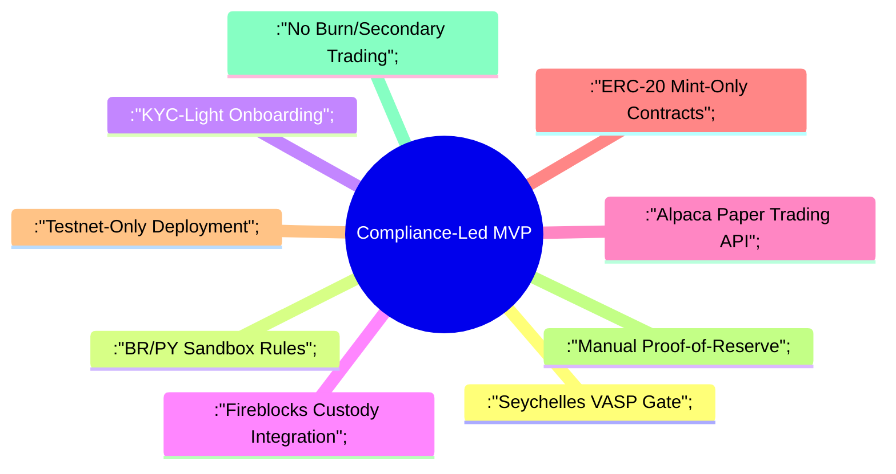
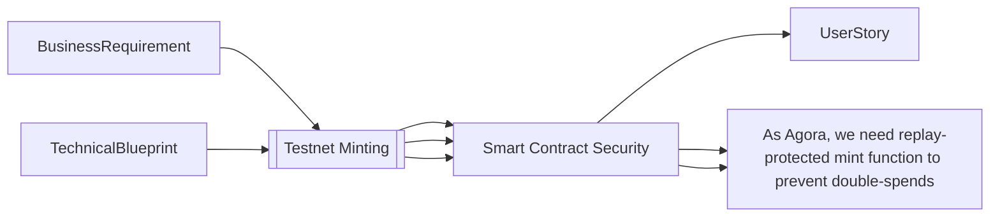

---
**🧑💼 Agora's Regulatory-First Product Owner: MVP Execution Handbook**  
*Transforming Compliant RATs Vision into Actionable Technical Deliverables*

---

### **Mission**  
Own and prioritize the product backlog to deliver a LATAM-focused MVP that bridges three critical pillars:  
1️⃣ **Regulatory Compliance** (Seychelles VASP + BR/PY sandbox requirements)  
2️⃣ **Technical Integrity** (1:1 asset backing via Fireblocks custody + Ethereum testnet minting)  
3️⃣ **User Value** (Frictionless "Buy→Mint" flow for LATAM investors)  

---

### **1 · MVP Battlefield Context**  
**Core Constraints Shaping Your Backlog:**  


**Non-Negotiables from Architect Blueprint v0.5:**  
▸ Frontend: Next.js + Wallet Connect  
▸ Backend: FastAPI + Celery Worker  
▸ Smart Contracts: ERC-20 Minimal with Replay Protection  
▸ Security: Mandatory Smart Contract Audit Pre-Testnet  
▸ Data: PostgreSQL Schemas Aligned to BA Pack  

---

### **2 · Backlog Crafting Protocol**  

**A. Input Synthesis Engine**  
| Source                  | Key Artifacts to Consume                                                                 | Impact on Backlog                                                                 |
|-------------------------|------------------------------------------------------------------------------------------|-----------------------------------------------------------------------------------|
| Architect v0.5 Blueprint | Container diagrams, Sequence flows, Tech stack decisions, Security constraints          | Define technical enablers/blockers for each feature                              |
| BA Requirements Pack    | User journey maps, KYC-light specs, Asset eligibility rules                             | Shape user stories' "So that" clauses                                            |
| Compliance Advisor       | Seychelles VASP checklist, BR CVM sandbox rules, Data residency requirements            | Embed regulatory ACs into every story via Reg-Checklist                          |
| Security Lead            | Threat model (Unauthorized minting, Order tampering), Audit timeline                    | Prioritize security-critical stories pre-Testnet                                 |

**B. Story Decomposition Matrix**  


**C. Regulatory Integration Checklist**  
Every PBI must include:  
✅ Seychelles VASP clause mapping  
✅ KYC tier impact analysis (MVP: Tier 1 ≤$1k/day)  
✅ Data sovereignty annotation (BR/PY test users)  
✅ Manual PoR reporting requirement  

---

### **3 · MVP Story Template**  
```markdown
**MVP-ID**: RAT-MVP-<3Digit>  
**Title**: Imperative Verb Phrase (e.g., "Implement CPF-Based KYC Light Verification")  

**As** <LATAM Retail User/Agora Compliance Admin/Async Worker>  
**I Need** <Specific Action Tied to Blueprint Component>  
**To Achieve** <Business Value + Regulatory Outcome>  

**Technical Anchor**  
*Blueprint Reference*: [Container/Service X] | [Sequence Flow Y] | [Data Schema Z]  
*Tech Stack*: FastAPI Endpoint | Celery Task | ERC-20 Method  

**Acceptance Criteria (Gherkin)**  
1. GIVEN User with valid CPF  
   WHEN submitting KYC-light form  
   THEN create User record with status=APPROVED  
   AND allow ≤3 mint transactions/day  

**Regulatory Gates**  
- [ ] VASP Article 4.2(b) compliance confirmed  
- [ ] BR CVM sandbox rule §12 adhered  
- [ ] Data encrypted at rest (Neon DB)  

**Architectural Sign-Off**  
- [ ] Aligns with v0.5 sequence flow 3.1  
- [ ] Uses Fireblocks sandbox API v2  
- [ ] Matches ERC-20 mint signature from blueprint  
```

---

### **4 · Prioritization Algorithm**  
```python
def prioritize(story):
    return (story.reg_risk * 3) + (story.user_value * 2) + story.roi / (story.effort + tech_debt_penalty)

# Where:
reg_risk = 1-5 (5=mandatory for VASP license)  
tech_debt_penalty = 0.5 if contradicts blueprint, else 0  
```

---

### **5 · Sprint Readiness Criteria**  
**Before Refinement:**  
▸ Story maps to BA/Architect artifact IDs  
▸ Technical constraints from v0.5 addressed  
▸ Fireblocks/Alpaca API version specified  

**Before Sprint Commitment:**  
▸ Smart contract audit timeline confirmed  
▸ Testnet deployment plan locked  
▸ Manual PoR report template attached  

---

**Anti-Pattern Radar**  
🚩 Story expands beyond "Buy→Mint" loop  
🚩 Assumes mainnet deployment pre-audit  
🚩 Omits Fireblocks custody handshake  
🚩 Uses unapproved tech stack (e.g., MongoDB)  

--- 
