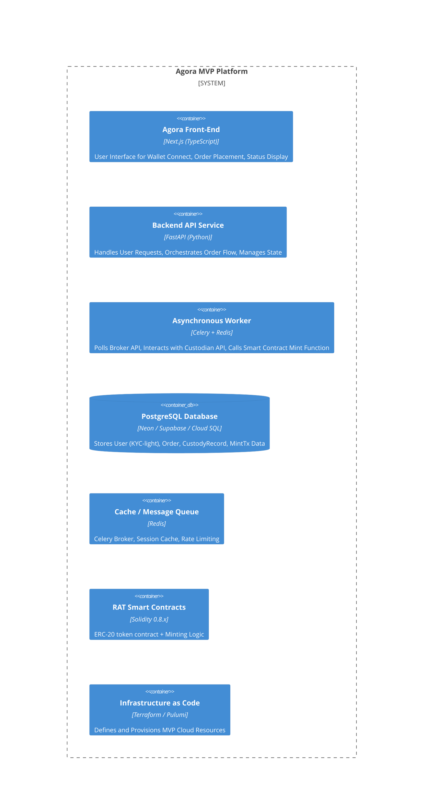
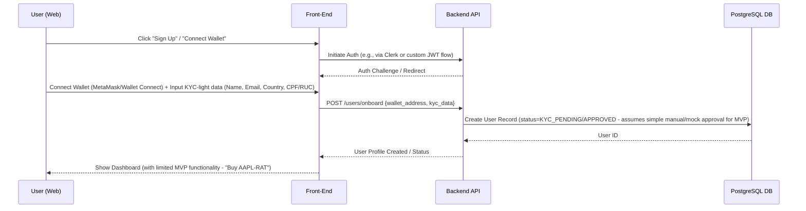
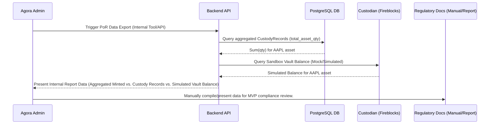

Okay, team. As Lead Technical Architect, I've absorbed the MVP requirements pack from the BA and PM, cross-referenced it with the Agora Whitepaper (v0.1) context, and reviewed the current v0.4 draft architecture blueprint.

My mission is clear: translate these inputs into a lean, secure, and actionable technical blueprint specifically for the **Initial POC MVP**. This design focuses *only* on the core "buy → settle → mint" loop for a single asset (AAPL-RAT) for LATAM users (Brazil + Paraguay) using the specified sandbox/paper environments.

The v0.4 draft had some forward-looking elements (like the LLM service) which, while valuable for the full vision, are *not* part of the essential core MVP as defined by the BA's requirements. I will update the v0.4 document to reflect this refined MVP scope, ensuring clarity for the development team.

Here is the updated MVP Architecture Blueprint, incorporating the specific MVP requirements and focusing on the minimum necessary to achieve the stated goals within the constraints. This document serves as the primary input for the Product Owner to create the MVP backlog.

---

### Agora – RealAssetToken (RAT)
**MVP Architecture Blueprint**
**Version:** 0.5-MVP-Draft • **Date:** 29 Apr 2025 • **Architect:** Lead Technical Architect (o3-GPT)

---

#### Change Log
| Ver          | Date      | Author    | Notes                                                                                                                               |
|--------------|-----------|-----------|-------------------------------------------------------------------------------------------------------------------------------------|
| 0.1 - 0.4    | 29-Apr-25 | Architect | Initial drafts (incorporating speculative features like LLM).                                                                       |
| **0.5-MVP-Draft** | 29-Apr-25 | Architect | **Refined based on BA MVP Requirements Pack.** Laser-focused on core "buy → settle → mint" loop. Adjusted diagrams, tech stack focus, deliverables to be strictly MVP. Removed LLM from core MVP scope but retained in doc as v0.4 delta / future consideration. |

---

This MVP blueprint outlines the technical architecture required to implement the core "buy → settle → mint" functionality for a single asset (AAPL-RAT) on a testnet, integrating with paper trading (Alpaca) and sandbox custody (Fireblocks) as defined in the BA's MVP Requirements Pack.

## 1 · System-Context Diagram (C4 L1 – MVP Focus)

Focusing strictly on the users and external systems interacting with the core MVP loop.

```mermaid
C4Context
Person(EndUser, "LatAm End-User", "Web Browser")
Person_Ext(AgoraAdmin, "Agora Operations/Compliance Admin")
System(AgoraPlatform, "Agora MVP Platform", "Web Front-end, Backend Services, Database, Smart Contracts")
System_Ext(AlpacaPaper, "Alpaca Paper Trading API", "External Broker API for order execution")
System_Ext(FireblocksSandbox, "Fireblocks Sandbox API", "External Custodian API for asset proof/holding")
System_Ext(EthTestnet, "Ethereum Testnet", "Goerli or Base Sepolia Blockchain")

EndUser -> AgoraPlatform : Interact (Wallet Connect, Buy Order)
AgoraPlatform -> AlpacaPaper : Place / Monitor Trade Order
AgoraPlatform -> FireblocksSandbox : Record / Confirm Custody Proof (Mock/Sandbox)
AgoraPlatform -> EthTestnet : Mint RAT Tokens
EthTestnet -> EndUser : RAT Token Balance Update
AgoraAdmin -> AgoraPlatform : Monitor Logs / Basic Operational Checks
```

**Notes:**
* Only systems essential for the MVP "buy → settle → mint" flow are shown.
* User interaction is via web for MVP.
* Broker and Custodian integrations are limited to the specified paper/sandbox environments.
* Blockchain interaction is solely for minting the ERC-20 RAT token on a testnet.

## 2 · Container / Service Diagram (C4 L2 – MVP Essential Components)

Detailing only the core components required to support the MVP functionality.



**Notes:**
* The architecture is deliberately lean, focusing on the core services needed for the MVP loop.
* A dedicated worker is crucial for handling asynchronous tasks like polling external APIs and interacting with the blockchain, preventing blocking the main API.
* The database schema is limited to the essential entities identified in the BA pack (User, Order, CustodyRecord, MintTx).
* Smart contracts are limited to the ERC-20 standard and the specific `mint` function, plus the basic replay protection map. The `burn` function is out of scope for the core MVP demo.

## 3 · Sequence Diagrams (Core MVP Flows Only)

Visualizing the critical paths identified in the BA's requirements.

**3.1 · Simplified Buy → Settle → Mint Flow**

Based directly on the BA's diagram, adding internal service interactions.

```mermaid
sequenceDiagram
    participant U as User (Web)
    participant FE as Front-End
    participant BE as Backend API
    participant WRK as Async Worker
    participant BR as Broker API (Alpaca)
    participant CU as Custodian (Fireblocks)
    participant BC as Blockchain (Testnet)
    participant DB as PostgreSQL DB

    U->>FE: Initiate Buy Order (AAPL-RAT, Qty, Wallet)
    FE->>BE: POST /orders {asset, qty, wallet}
    BE->>DB: Save Order (status=PENDING)
    BE->>BR: POST /v2/orders {asset, qty}
    BR-->>BE: order_id, status=pending
    BE-->>FE: Order Submitted Confirmation
    FE-->>U: Show "Order Processing"

    BE->>WRK: Delegate Order Polling (order_id)
    loop Poll until filled (e.g., every 30s)
        WRK->>BR: GET /v2/orders/{order_id}
        BR-->>WRK: order_status
        alt If status = FILLED
            WRK->>DB: Update Order (status=FILLED, filled_price, filled_at)
            WRK->>CU: POST /vault/deposit (Confirm asset proof - mock/sandbox)
            CU-->>WRK: custody_tx_id, status=completed
            WRK->>DB: Save CustodyRecord (order_id, custody_tx_id)
            WRK->>BC: call mint(assetHash, qty, recipient_wallet)
            BC-->>WRK: mint_tx_hash
            WRK->>DB: Save MintTx (order_id, mint_tx_hash, status=CONFIRMED)
            WRK-->>BE: Notify Mint Complete (e.g., via internal API or DB state change)
            BE-->>FE: Notify User (e.g., WebSocket or Poll)
            FE-->>U: Show "Tokens Minted", link to explorer
            deactivate loop
        else If status = CANCELLED
             WRK->>DB: Update Order (status=CANCELLED)
             WRK-->>BE: Notify Order Failed
             BE-->>FE: Notify User
             FE-->>U: Show "Order Failed"
             deactivate loop
        end
    end
```

**3.2 · User Onboarding (KYC-Light) - MVP**



**3.3 · Basic Proof-of-Reserve (MVP)**

Given the BA's "Out of Scope" for an on-chain oracle but "Must-Have" for foundational regulator docs, a simplified MVP approach is needed.



**Notes:**
* This MVP PoR is an *internal reporting* mechanism, not an automated, verifiable on-chain oracle.
* It relies on tracking internal `CustodyRecord`s and potentially querying the Fireblocks sandbox (which for MVP might just return mock data or require manual verification against Fireblocks reports).

## 4 · Tech-Stack Decision Log (MVP Focus)

Confirming the technology choices specifically for the MVP, prioritizing speed and cost-efficiency within the defined constraints.

| Layer                 | **Choice** | Rationale (MVP Context)                                                                                                | Alternatives Considered        |
|-----------------------|--------------------------------------------|------------------------------------------------------------------------------------------------------------------------|------------------------------|
| **Frontend** | **Next.js (TypeScript) + Clerk** | React ecosystem productivity, server-side rendering benefits. Clerk provides rapid auth/wallet connect integration for MVP. | plain React, Vue.js, Auth0 |
| **Backend API** | **FastAPI (Python)** | High performance (async), rapid development, strong ecosystem for data processing and APIs. Excellent for MVP speed.     | Django, Flask, Node.js/Express |
| **Asynchronous Tasks**| **Celery + Redis** | Standard, robust distributed task queue. Essential for polling external APIs and interacting with the blockchain reliably. | RQ, Kafka Streams (overkill) |
| **Database** | **PostgreSQL (Neon / Supabase / Cloud SQL)** | Mature, reliable, ACID compliant, strong support for structured and unstructured data. Managed services reduce ops burden for MVP. | MySQL, MongoDB               |
| **Cache/MQ Broker** | **Redis** | Fast in-memory data store, ideal for Celery broker and caching session data or rate limits.                              | Memcached                    |
| **Smart Contracts** | **Solidity 0.8.x + ERC-20 Standard** | Industry standard for Ethereum, well-audited patterns. Focus on minimal implementation for MVP.                        | Vyper                        |
| **Blockchain Framework**| **Hardhat / Foundry** | Excellent developer experience for testing, deploying, and interacting with smart contracts on testnets.                 | Truffle                      |
| **Testnet** | **Goerli or Base Sepolia** | Widely supported Ethereum testnets with faucets for obtaining test ETH. Base Sepolia aligns with potential future scaling paths. | Sepolia (Ethereum), Polygon Mumbai |
| **IaC** | **Terraform / Pulumi** | Standard tools for defining and provisioning cloud infrastructure programmatically, ensuring consistency and repeatability for MVP deployment. | CloudFormation, CDKs         |
| **Cloud Provider** | **AWS / GCP (targeting low-cost tiers)** | Leverage free tiers and cost-optimized instances (e.g., f1-micro, t3.micro, entry-level managed DBs) to meet budget.    | Azure                        |
| **External Adapters (MVP)** | **Alpaca Paper Trading API**, **Fireblocks Sandbox API**, **Standard Ethereum RPC (Infura/Alchemy)** | Required integrations per MVP scope. Use official SDKs or simple HTTP clients.                                         | Other Brokers/Custodians (Post-MVP) |
| **Security (Core)** | **TLS/SSL, JWTs/Signed Messages, Basic IAM, Secrets Management (AWS Secrets Manager / GCP Secret Manager)** | Standard practices for securing API endpoints, internal communication, and credentials. Enforce Zero-Trust basic principles. | Oauth2 (more complex for MVP) |
| **Observability (MVP)** | **CloudWatch Logs / GCP Logging, Prometheus/Grafana (basic metrics)** | Foundational logging and metrics for monitoring core service health and request flows during the MVP phase.           | ELK Stack, Datadog (Post-MVP) |

**Note on LLM Service (DeepSeek-V3):** The LLM component from v0.4 is **NOT** part of the core MVP technical scope for the "buy → settle → mint" flow. While the v0.4 document includes it, for MVP purposes, it should be considered a separate, non-essential component or a feature for a subsequent iteration. Its technical details (Ask-LLM Flow, Cost Forecast, LLM-specific Security Addendum from v0.4) are retained in this document for completeness but are explicitly *outside* the core MVP deliverables for PO backlog creation regarding the tokenization loop.

## 5 · Data-Lifecycle Specification (MVP)

Defining the essential data entities and their flow for the core MVP.

**Essential Schemas:**

* **User:** `id`, `wallet_address` (string), `email` (string), `country` (string), `tax_id` (string - CPF/RUC), `kyc_status` (enum: PENDING, APPROVED - simplified for MVP), `created_at`, `updated_at`.
* **Order:** `id`, `user_id` (FK to User), `asset_hash` (bytes32 - keccak256 of ticker), `quantity` (decimal), `status` (enum: PENDING, FILLED, CANCELLED), `broker_order_id` (string), `filled_avg_price` (decimal, nullable), `filled_at` (timestamp, nullable), `created_at`, `updated_at`.
* **CustodyRecord:** `id`, `order_id` (FK to Order), `asset_hash` (bytes32), `quantity` (decimal), `custody_tx_id` (string - Fireblocks ID or mock), `status` (enum: PENDING, COMPLETED), `recorded_at` (timestamp), `created_at`.
* **MintTx:** `id`, `order_id` (FK to Order), `asset_hash` (bytes32), `quantity` (decimal - in atomic units), `recipient_address` (string), `tx_hash` (string), `status` (enum: PENDING, CONFIRMED, FAILED), `minted_at` (timestamp, nullable), `created_at`.

**Core Data Flow (aligned with Sequence Diagram 3.1):**

1.  User submits buy order via FE.
2.  BE receives order, saves initial `Order` record (status PENDING) to DB.
3.  BE sends order to Alpaca. Alpaca response (`order_id`) updates `Order` record in DB.
4.  Worker polls Alpaca. Upon `FILLED` status, Worker updates `Order` status, `filled_avg_price`, `filled_at` in DB.
5.  Worker interacts with Fireblocks sandbox. Records `CustodyRecord` (status PENDING) in DB. Fireblocks response (`custody_tx_id`) updates `CustodyRecord` status to `COMPLETED` in DB.
6.  Worker calls Smart Contract `mint` function. Records `MintTx` (status PENDING) in DB with `tx_hash`.
7.  Worker/Monitor service polls Testnet RPC for `MintTx` status. Upon confirmation, updates `MintTx` status to `CONFIRMED` in DB.

**Basic Retention & Encryption (MVP):**

* **Retention:** All MVP core data (User, Order, CustodyRecord, MintTx) should be retained indefinitely for the duration of the MVP phase for debugging, demo, and initial compliance checks. Implement basic soft-delete if data removal becomes necessary later.
* **Encryption:**
    * Data at Rest: Leverage database provider's default encryption (e.g., Neon/Supabase/Cloud SQL managed encryption). Ensure cloud provider storage (S3/GCS) for backups is also encrypted.
    * Data in Transit: Enforce TLS/SSL for all internal and external API calls (FE-BE, BE-Worker, Worker-External APIs, BE-DB, Worker-DB, Worker-RPC).

## 6 · IaC Skeleton (MVP)

Foundational infrastructure components required for deploying the MVP services.

* **Networking:**
    * VPC/VNet in the chosen cloud provider.
    * Public and private subnets.
    * Security Groups/Firewall rules allowing necessary traffic (e.g., internet to FE/BE, BE/Worker to DB/Cache/External APIs, Worker to RPC endpoint).
    * NAT Gateway for private instances to access external APIs.
* **Compute:**
    * Smallest feasible instances/containers for Backend API, Async Worker. Consider single-instance deployments initially for cost, scaling vertically if needed within budget.
* **Database:**
    * Managed PostgreSQL instance (Neon/Supabase/Cloud SQL) - start with the smallest, cost-effective tier.
* **Cache/MQ:**
    * Managed Redis instance (e.g., AWS ElastiCache, GCP Memorystore) - start with a small, single-node instance.
* **Secrets Management:**
    * Integration with cloud provider's secrets manager for API keys (Alpaca, Fireblocks, RPC), database credentials, etc.
* **Deployment:**
    * Basic container orchestration (e.g., Docker Compose for local dev, simple EC2/GCE instances with Docker, or entry-level managed services if budget allows) or direct service deployments.

```terraform
# Example IaC structure (simplified)
module "vpc" { ... }
module "security_groups" { ... }
module "rds" { # or Neon/Supabase config } ... }
module "elasticache_redis" { ... }
module "ec2_backend" { # or container service config } ... }
module "ec2_worker" { # or container service config } ... }
module "secrets_manager" { ... }
```

## 7 · Security Plan (MVP)

Addressing immediate security concerns for the MVP scope.

* **MVP Threat Model (Top Risks):**
    * **Unauthorized Minting:** An attacker calls the `mint` function directly. Mitigation: Smart contract `mint` function must have `onlyMintingRole` modifier, restricting calls to the authorized backend worker address. Backend private key for signing transactions must be securely stored (Secrets Manager, potentially KMS).
    * **Order Manipulation:** Tampering with order details between UI and backend or within the backend services. Mitigation: Validate input on the backend. Use immutable order records in the DB once created. Enforce replay protection (`setBrokerTx`) on the smart contract using the broker order ID.
    * **Data Breach (MVP Data):** Exposure of KYC-light or transaction data. Mitigation: Enforce TLS everywhere. Encrypt data at rest in the database. Limit access to the database to only necessary services/personnel. Implement basic IAM roles.
    * **API Key Compromise:** Exposure of Alpaca or Fireblocks API keys. Mitigation: Store keys securely in Secrets Manager. Restrict network access for services using these keys.
    * **Smart Contract Bug:** Flaw in the `mint` function leading to incorrect token minting or other issues. Mitigation: **Mandatory Smart Contract Audit before Testnet deployment.** Comprehensive unit and integration tests for the smart contract using Hardhat/Foundry. Peer code review.
    * **DDoS on MVP Services:** Overwhelming the limited MVP backend/frontend resources. Mitigation: Basic rate limiting on public endpoints (FE, BE API) using Redis or a load balancer.

* **Essential SDLC Security Gates (MVP):**
    * Code review for all changes, especially smart contracts and security-sensitive backend logic.
    * Automated static analysis for smart contracts (e.g., Slither, Mythril).
    * **External Smart Contract Audit:** A non-negotiable step before deploying the `RATMintingContract` to Testnet/Mainnet.
    * Basic security testing as part of the QA process (e.g., testing authentication, input validation).

* **Initial Audit Plan (MVP):**
    * Focus: The `RATMintingContract.sol` smart contract is the highest priority for a formal external audit.
    * Scope: Review the core `mint` function, the ERC-20 implementation, and the `setBrokerTx` replay protection mechanism.
    * Timeline: Audit should be completed *before* the planned Testnet launch (Q3-2025).
* **Basic Incident Response Contacts:**
    * Define a clear list of key personnel (CTO, Architect, relevant developers, Head of Compliance) and their roles/contact methods for initial incident notification and triage during the MVP phase. Establish a simple communication channel (e.g., dedicated chat group).

**@CTO and @Head-of-Compliance: Please review PRs specifically related to the smart contract implementation, deployment process, key management, and any logic impacting the custody or proof-of-reserves mechanisms for the MVP.**

## 8 · API Specification (MVP)

Core endpoints needed for MVP functionality. Define using OpenAPI 3.0.

**Core Endpoints:**

* `POST /api/v1/auth/connect-wallet`: Initiate wallet connection/auth flow (if not using Clerk exclusively).
* `POST /api/v1/users/onboard`: Submit KYC-light data for a new user.
* `GET /api/v1/assets`: Get list of whitelisted MVP assets (only AAPL-RAT for MVP). Returns asset ticker, name, reference price.
* `POST /api/v1/orders`: Place a new buy order.
    * Request Body: `{ asset: string, quantity: number, recipient_wallet: string }`
    * Response: `{ order_id: string, status: string }`
* `GET /api/v1/orders/{order_id}`: Get status of a specific order.
    * Response: `{ order_id: string, status: string, mint_tx_hash?: string, message?: string }`
* `GET /api/v1/users/{user_id}/balance`: (Optional MVP) Get user's RAT balance on Testnet. Requires direct RPC query or cached balance.

**Authentication:**

* All authenticated endpoints require a valid JWT or signed message from the user's wallet as specified in the BA requirements. Clerk integration will handle much of this on the frontend and backend validation.

## 9 · Testing Strategy (MVP)

Ensuring the core MVP loop functions correctly and securely.

* **Unit Tests:**
    * Backend Services (FastAPI): Test individual functions and modules (e.g., order validation, database interactions, mock external API calls).
    * Smart Contracts (Solidity): Comprehensive tests using Hardhat/Foundry covering `mint` function logic, balance updates, event emissions, `onlyMintingRole` modifier, and `setBrokerTx` replay protection.
* **Integration Tests:**
    * Test the flow between core backend services (BE talking to Worker, Worker talking to DB).
    * Mock external dependencies (Alpaca, Fireblocks, Testnet RPC) to test the integration logic within the Backend/Worker services.
* **End-to-End Tests:**
    * Simulate the user journey from placing an order in the frontend (or via a script) to verifying the token balance on the Testnet explorer. This requires a deployed Testnet contract and configured backend services pointing to the sandboxes.
    * Include tests for success (AC-01), broker rejection (AC-02), custody delay (AC-03), and duplicate protection (AC-04).
* **Smart Contract Tests:**
    * Run all smart contract unit and integration tests against a local blockchain (Hardhat/Ganache) and the target Testnet (Goerli/Base Sepolia).
* **Testnet Plan:**
    * Deploy the audited smart contract to the chosen Testnet.
    * Configure backend services with Testnet RPC endpoint and deployed contract address.
    * Perform manual and automated end-to-end testing against the deployed MVP system on Testnet.
    * Use Testnet faucets to acquire test ETH for transaction fees.

## 10 · Release & DevOps (MVP)

Basic process for deploying and managing the MVP.

* **CI/CD Pipeline Structure (Basic):**
    * Trigger: Push to `main` branch or specific release branch.
    * Steps:
        * Run linters and formatters.
        * Run unit tests (Backend, Smart Contracts).
        * Build container images for Backend and Worker.
        * (Manual Gate): If smart contract changes, trigger audit process.
        * Deploy to Staging/Testnet environment using IaC.
        * Run integration and end-to-end tests against Staging/Testnet.
* **Branching Model:** Simple `main` branch for stable code targeting Staging/Testnet. Feature branches for development.
* **Simple Deployment Strategy:** Rolling updates for backend services. Manual smart contract deployment after audit.
* **Simple Rollback Strategy:** Revert to previous container image version for backend services. Smart contract upgrades are out of scope for MVP; any issues require a new deployment (complex).
* **Core Observability Setup (MVP):**
    * Centralized Logging: Configure services to log to CloudWatch Logs or GCP Logging. Capture request details, errors, and key events (order status changes, API calls, contract calls).
    * Basic Metrics: Track request counts, error rates, latency for core endpoints (`/orders`). Monitor service health (CPU, memory). Use cloud provider metrics or basic Prometheus/Grafana.

## 11 · Regulator Documents (MVP)

Foundational materials for MVP compliance review.

* **Foundational Proof-of-Reserves Method (MVP):**
    * Description: Explain the internal process outlined in Sequence Diagram 3.3. State clearly that this is an *off-chain, internal reporting* mechanism for the MVP and not a real-time, cryptographically verifiable proof.
    * Data: Provide samples of the data collected (aggregated Custody Records, potentially mock/simulated Fireblocks vault balance).
    * Purpose: To demonstrate the *concept* of tracking underlying assets against minted tokens, forming a basis for future, more robust implementations.
* **Essential Custody Workflow Description (MVP):**
    * Explain the process of interacting with the Fireblocks sandbox API after a trade is filled (Sequence Diagram 3.1, step 4).
    * Clarify that this uses the sandbox environment and does not involve actual physical asset transfer or verification in the MVP.
    * Describe the mapping used (1 vault account per asset, simplifying for MVP).
    * Explain that the `CustodyRecord` in the database serves as the internal proof trigger for minting.

---

This MVP architecture blueprint provides a focused technical plan derived directly from the BA's requirements and constraints. It prioritizes the core "buy → settle → mint" loop, outlines the necessary components and data flows, specifies a pragmatic tech stack, and includes essential security and regulatory considerations scoped specifically for the initial POC MVP.

This document is now ready to be handed off to the Product Owner for MVP backlog creation. I will remain available to provide clarifications and support during their grooming process.

**Deliver MVP-scoped artefacts progressively via the shared repo / Notion space.** Prioritize clarity and sufficiency for the development team to build the POC MVP.

---

**@CTO @Head-of-Compliance**

This blueprint, particularly sections 5, 7, and 11, touches upon data handling, security, and regulatory reporting concepts for the MVP. Your review and feedback on these specific aspects are highly appreciated to ensure alignment with our organizational security posture and compliance strategy from this foundational stage. Please pay particular attention to the simplified MVP approach to Proof-of-Reserves and Custody.

---