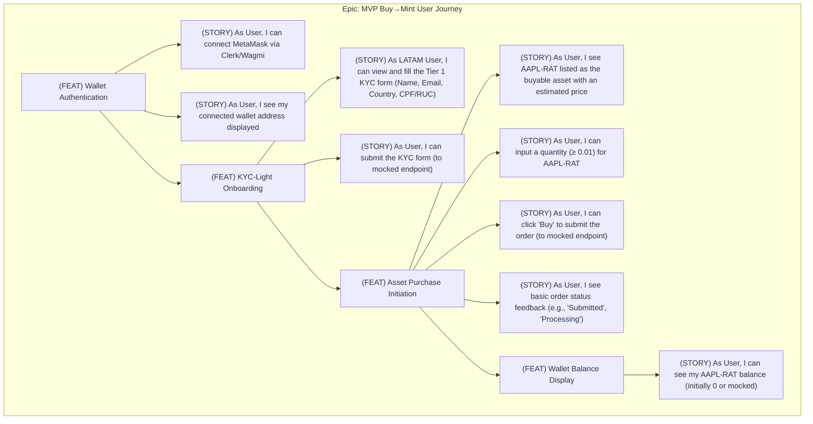

Okay, Lead Architect and BA, excellent inputs. I've synthesized the MVP requirements, the integration plan, and the refined architecture blueprint.

My focus now shifts to translating this into an actionable backlog, specifically prioritizing the **front-end team's ability to build and demonstrate the core user interactions quickly**. We need visible progress on the UI, even while the backend plumbing and external integrations are being finalized.

This adapted handbook section reframes our standard PO process to put **UI enablement first** for the initial sprints of the Agora MVP.

---

## 🧑💼 Agora's Regulatory-First Product Owner: MVP Execution Handbook
*🔁 Now Prioritized for Front-End Enablement (Next.js + Clerk + Wagmi)*

---

### ✅ **Immediate PO Focus: Kickstart Front-End Capability**

The absolute priority for Sprint 0/1 is to empower the front-end team (Next.js) to:
1.  **Render Core Screens:** Login/Connect, KYC-Light Form, Basic Dashboard, Buy AAPL-RAT page.
2.  **Integrate Wallet Connection:** Implement Clerk/Wagmi/Web3Modal for wallet connection (MetaMask focus initially).
3.  **Submit Core Forms (Mocked):** Allow users to *click* "Submit KYC" and "Buy AAPL-RAT", firing requests to *mocked* or stubbed backend endpoints. We need the UI flow functional before the full backend logic is live.

This ensures we have a demonstrable user journey shell rapidly, allowing for early feedback and parallel backend development.

---

### **2 · Backlog Crafting Protocol — UI-First Focus**

#### **A. Input Synthesis Engine (Reordered for Frontend Readiness)**

| Source                  | Front-End Impact                                                     | Artifact Relevance to UI Stories                                                |
|-------------------------|----------------------------------------------------------------------|----------------------------------------------------------------------------------|
| **UX Wireframes/Figma** | **PRIMARY:** Defines routes, components, states, modals, basic layout. | Shapes component hierarchy, user flow, initial styling needs (Tailwind/Tokens). |
| **Architect Blueprint (v0.5)** | Clarifies FE tech stack (Next.js, Clerk, Wagmi), component-to-service binding (API calls), auth flow. | Ensures consistency with wallet logic, API structure, core data models (User, Order). |
| **MVP Req Pack (v0.2)** | Defines KYC fields (Tier 1), asset (AAPL), core journey steps, acceptance criteria (user perspective). | Enforces required fields, validation rules (client-side), happy-path definition. |
| **API Spec Draft (from Arch)** | Guides button actions, form submission mapping (request/response shapes), error handling display. | Avoids UI refactors. Allows FE to build against *draft* or *mocked* endpoints initially. |
| **Compliance Advisor Input** | Specific wording for disclaimers, T&Cs links, regional requirements (CPF/RUC format hints). | Ensures legally required text/links are placed correctly in the UI early. |

---

#### **B. Story Decomposition – UI-Centric MVP First Layer**

We decompose the core "Buy → Mint" Epic into features visible *first* in the UI.


*Initial sprints focus on implementing the UI for these stories, potentially hitting mock APIs.*

---

### **3 · MVP UI Story Template**

This template prioritizes front-end needs.

```markdown
**MVP-ID**: RAT-MVP-<3Digit>
**Title**: FE - Implement [Component/Action] for [Feature]

**As a** [Specific User Type, e.g., LATAM Retail User]
**I Need** a clear and functional UI component to [Perform Action, e.g., connect my wallet, submit my KYC details]
**So That** I can progress through the core MVP journey using the web interface on testnet.

**Component Anchor**
*   **Route/Page**: `/auth/connect`, `/onboarding/kyc`, `/dashboard/buy`
*   **Key Component(s)**: `WalletConnectButton`, `KycForm`, `BuyOrderWidget`
*   **FE Tech Stack Context**: Next.js 15, TypeScript, Clerk, Wagmi, Web3Modal, TailwindCSS
*   **Relevant API Contract(s)**: `POST /users/onboard` (mocked for Sprint 1), `POST /orders` (mocked for Sprint 1)
*   **Figma Link**: [Link to relevant Figma screen/component]

**Acceptance Criteria (UI Focus)**
1.  GIVEN I am on the `/onboarding/kyc` page
    WHEN I fill in valid Name, Email, Country (BR/PY), and CPF/RUC
    AND I click "Submit KYC"
    THEN a `POST /users/onboard` request is triggered (verifiable in browser dev tools, even if hitting a mock 200 OK).
2.  GIVEN the KYC form is displayed
    WHEN I enter an invalid CPF format
    THEN client-side validation displays an appropriate error message below the field.
3.  GIVEN the component renders
    THEN it matches the layout, styling, and responsiveness defined in the Figma link.
4.  GIVEN the API call is mocked to return success
    THEN the UI transitions to the expected next state (e.g., shows "KYC Submitted" message, redirects to dashboard).

**Regulatory Gates (UI Perspective)**
*   [ ] KYC form includes all fields required for Tier 1 (per MVP Req Pack).
*   [ ] Input masks or validation hints match BR CPF / PY RUC formats.
*   [ ] Required legal disclaimers/links are visible near submission buttons.

**Architectural Sign-Off Checks (FE Focus)**
*   [ ] Uses the central Clerk/Wagmi configuration for wallet interaction.
*   [ ] Component state management aligns with the draft API response structure.
*   [ ] Does not introduce new FE dependencies without approval.
*   [ ] Follows established FE coding standards and component patterns.

**Notes / Mocking Strategy**
*   *For Sprint 1, this story assumes `POST /users/onboard` returns a static 200 OK response.*
*   *Error handling for API failures can be a separate follow-up story.*
```

---

### **4 · Sprint Prioritization: UI Layer First**

We use a weighted scoring model biased towards unblocking the UI and demonstrating the core flow visually.

```python
# Simplified Prioritization Logic for Early Sprints
def prioritize_for_frontend_sprint(story):
  score = 0
  # Is it essential for the core visual flow? (Login -> KYC -> Buy -> See Balance)
  if story.is_core_visual_flow: score += 5
  # Does it unblock other FE work? (e.g., Wallet Connect needed for everything else)
  if story.unblocks_other_fe: score += 4
  # Can the backend be easily mocked/stubbed for this UI?
  if story.is_easily_mockable: score += 3
  # How much user value does this UI element provide directly?
  score += story.ux_visibility_rank # (1-5)
  # Effort (lower is better, invert for scoring)
  score += (5 - story.dev_effort_estimate) # (1-5, 5=easy, 1=hard)
  return score

# Example Attributes (Illustrative):
# story_connect_wallet = { is_core_visual_flow: True, unblocks_other_fe: True, is_easily_mockable: True, ux_visibility_rank: 5, dev_effort_estimate: 2 }
# story_kyc_form = { is_core_visual_flow: True, unblocks_other_fe: False, is_easily_mockable: True, ux_visibility_rank: 4, dev_effort_estimate: 3 }
# story_buy_button = { is_core_visual_flow: True, unblocks_other_fe: False, is_easily_mockable: True, ux_visibility_rank: 5, dev_effort_estimate: 1 }
```

**Likely Sprint 1 Candidate Stories (High Scores):**
1.  `RAT-MVP-101`: FE - Implement WalletConnectButton using Clerk/Wagmi
2.  `RAT-MVP-102`: FE - Display connected wallet address in header/profile area
3.  `RAT-MVP-201`: FE - Render KYC-Light Form with Name, Email, Country, CPF/RUC fields
4.  `RAT-MVP-202`: FE - Implement client-side validation for KYC fields (basic format checks)
5.  `RAT-MVP-301`: FE - Display AAPL-RAT asset info and quantity input on Buy page
6.  `RAT-MVP-302`: FE - Implement "Buy" button triggering mock `POST /orders` call
7.  `RAT-MVP-203`: FE - Implement "Submit KYC" button triggering mock `POST /users/onboard` call

*Backend stories for actual KYC processing, order placement via Alpaca, etc., run in parallel but don't block these initial UI stories.*

---

### **5 · UI-Story Sprint Readiness Criteria**

A story is ready for the **Sprint Backlog** (Commitment) only when:

**Before Refinement (PO Prep):**
*   ✅ Figma link points to the specific, **approved** screen/component design.
*   ✅ Core user flow context is clear (where does this fit?).
*   ✅ Acceptance Criteria drafted with a UI interaction focus.
*   ✅ Mock API response shape defined (even if just `{"status": "success"}`).
*   ✅ Regulatory/Compliance UI elements identified (text, links, field constraints).

**Before Commitment (Team Confirmation in Refinement/Planning):**
*   ✅ FE Team understands the requirements and ACs.
*   ✅ Required FE infrastructure is in place (e.g., routing set up for the page, Clerk/Wagmi configured).
*   ✅ Dependencies on other FE stories are identified.
*   ✅ Mocking strategy for backend calls is agreed upon.
*   ✅ Styling approach confirmed (Tailwind classes, design tokens available).
*   ✅ Effort estimated by the FE team.

---

This UI-first approach ensures we build momentum and get early visual feedback on the core Agora MVP experience, aligning with our goal of rapid, regulatory-aware iteration. Backend integration will follow closely, plugging into the established UI framework.