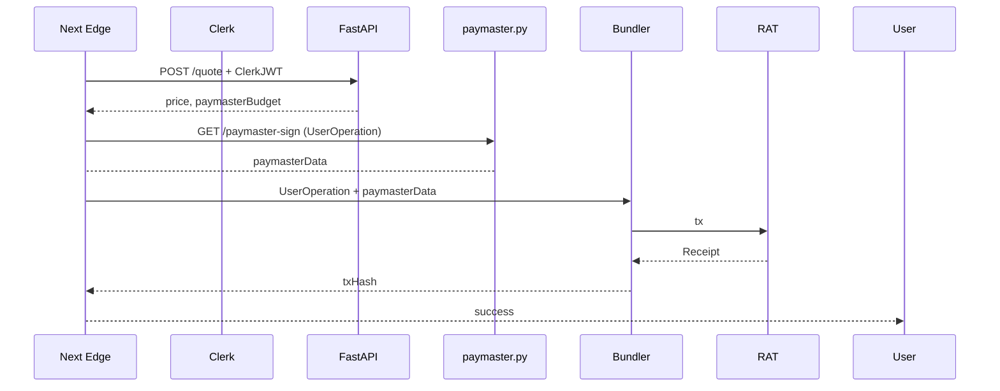

Below is a **concrete build plan** that folds the wallet-less PoC into the stack you picked (**Next 14 + TypeScript + Tailwind**, **FastAPI**, **Supabase (PostgreSQL)**, **Clerk**) while **avoiding any Node-only backend code**.

---

## 1 · Updated Component Map

| Domain | Runtime | Main Lib / Service | Why it fits |
|--------|---------|--------------------|-------------|
| **Web UI** | **Next 14 (App Router, Edge runtime)** on **Deno Deploy** or **Vercel Edge** | Runs on the Deno-based edge runtime—no Node server required; supports RSC, SWC & Turbopack. citeturn0search7 |
| **Auth** | Clerk SaaS + Supabase RLS | Clerk already exposes *web-3 login factors* (MetaMask, WalletConnect). Map `wallet_address` ↔ `clerk_user_id` to a dedicated schema in Supabase. citeturn0search6turn0search2 |
| **Smart-Wallet SDK** | Magic Connect (client-side only) | Drops a 30 kB script, creates ERC-4337 smart accounts and signs `UserOperation`s; runs fine inside Next Edge. |
| **Trade API** | **FastAPI** (Python 3.12, uvicorn workers) | Handles quotes, ledger mirror, paymaster signatures (web3.py); lives behind `/api` gateway. |
| **Data** | Supabase (managed Postgres 16) | Row-Level-Security + declarative schemas keep KYC, wallet map, gas budgets isolated. citeturn0search11 |
| **Bundler** | Stackup (Golang) | Containerised; FastAPI signs paymaster data, Bundler relays to Optimism-Sepolia. |
| **Storage / CDN** | R2 + Cloudflare Pages (static assets) | Cheap egress LATAM, integrates with Next export if you later move away from SSR. |

---

## 2 · Folder & Repo Layout

```
agora/
│
├─ frontend/          # Next 14
│   ├─ app/
│   │   ├─ (auth)/    # Clerk <SignIn/> etc.
│   │   └─ trade/
│   ├─ lib/aa.ts      # Magic, wagmi AA hooks
│   ├─ tailwind.config.ts
│   └─ tsconfig.json
│
├─ backend/
│   ├─ main.py        # FastAPI root
│   ├─ routers/
│   │   ├─ trade.py   # /quote, /submit
│   │   └─ user.py    # /link-wallet
│   ├─ models/        # Pydantic
│   └─ services/
│       └─ paymaster.py
│
├─ infra/terraform/
│   ├─ edge_frontend/     # Deno Deploy or Vercel project
│   ├─ fastapi_aws_eb/    # ECS Fargate or AppRunner
│   └─ supabase/
└─ docs/
```

---

## 3 · Key Integration Flows

### 3.1 Sign-Up & Wallet Link  
*(all calls typed end-to-end with `openapi-typescript`)*

1. **Client → Clerk**: e-mail/OAuth or *Sign-in with Web3* (MetaMask).  
2. **Client → FastAPI `/link-wallet`**  
   ```http
   POST /link-wallet
   Authorization: Bearer <ClerkJWT>
   { "wallet_address": "0xAB…", "aa_address": "0x4337…" }
   ```  
3. **FastAPI** verifies Clerk JWT (JWKs), inserts into `custody.user_wallet_map` (Supabase schema with RLS = `user_id() = clerk_uid`).  
4. Client receives a signed nonce → stores in localStorage for subsequent AA txs.

### 3.2 Gas-Sponsored Trade



---

## 4 · Code Snippets

### 4.1 Type-Safe Fetch (Next Edge)

```ts
// lib/api.ts
import { createClient } from '@supabase/supabase-js'
import { ClerkProvider, useAuth } from '@clerk/nextjs'
import type { QuoteResponse } from '@/models/openapi' // generated

export async function getQuote(pair: string) {
  const { getToken } = useAuth()
  const jwt = await getToken()                     // Clerk session
  const res = await fetch(`${process.env.NEXT_PUBLIC_API}/quote?pair=${pair}`, {
    headers: { Authorization: `Bearer ${jwt}` }
  })
  const data: QuoteResponse = await res.json()
  return data
}
```

### 4.2 FastAPI Router

```py
# routers/trade.py
from fastapi import APIRouter, Depends
from auth import clerk_verify                 # → decodes Clerk JWT
from schemas import QuoteResponse

router = APIRouter(prefix="/quote")

@router.get("", response_model=QuoteResponse)
async def get_quote(pair: str, user=Depends(clerk_verify)):
    price = await price_oracle(pair)
    budget = await gas_budget(user.id)
    return QuoteResponse(pair=pair, price=price, budget=budget)
```

### 4.3 Supabase Schema (wallet map)

```sql
create schema custody;

create table custody.user_wallet_map (
  clerk_uid   uuid references auth.users(id),
  wallet_eoa  text,
  wallet_aa   text,
  created_at  timestamptz default now(),
  primary key (clerk_uid, wallet_eoa)
);

-- RLS
alter table custody.user_wallet_map
  enable row level security;

create policy "Users access their own wallet map"
  on custody.user_wallet_map
  for all
  using (auth.uid() = clerk_uid);
```

---

## 5 · Running Next without Node

* **Edge runtime** (`export const runtime = "edge"`) compiles to the **Deno** VM Vercel uses; deploy to *Deno Deploy* or *Supabase Edge Functions* just as well.  
* Only local dev needs Node for tool-chain, not for production compute.  
  *If you truly want zero Node in CI*, add a **Bun** or **Deno** build step:  
  ```bash
  bunx next build && bunx next start
  ```  
  Edge-only routes will still be Deno-compatible. citeturn0search1turn0search4

---

## 6 · Milestone Add-on (Frontend Squad)

| Week | Ticket | Notes |
|------|--------|-------|
| **W 17-18** | `FE-01` Set up Next 14 in Edge mode, Tailwind, Clerk provider | `npx create-next-app -e with-clerk` then `runtime="edge"` |
| **W 18** | `FE-02` Integrate Magic Connect; AA hooks (wagmi v2) | Keep provider context above Clerk so wallet ≠ auth decoupled |
| **W 19** | `FE-03` Quote & trade pages; zod schema mirroring Pydantic | Use SWR / TanStack Query |
| **W 20** | `FE-04` Funnel & latency metrics via PostHog | Track drop-offs for PoC KPI 101-104 |

---

## 7 · Risks & Mitigations (Frontend ↔ Backend)

| Risk | Mitigation |
|------|------------|
| **Double source of truth (Clerk vs Supabase Auth)** | Disable Supabase Auth; use service role key for backend only. |
| **Next Edge incompat libs** | Stick to isomorphic libs; avoid Node-only crypto; fall back to CSR for legacy lib. |
| **Wallet spam** | Add recaptcha or 24h clerk rate-limit for `/link-wallet`. |
| **Supabase latency LATAM → sa-east-1** | Use Supabase enterprise geo-replica or move to Fly.io Postgres if needed. |

---

### 📌 Next Steps (actionable)

1. **Fork `agora/poc-walletless` → add `frontend/` skeleton (`FE-01`).**  
2. **Provision Supabase project** and execute the SQL above.  
3. **Generate OpenAPI types** with `openapi-typescript` post FastAPI build.  
4. **Demo “sign-up → first quote” path by end of W 18**.

Ping me in the repo if you hit Edge-runtime limitations—there are clean fallbacks that still keep the Node footprint off the critical path.