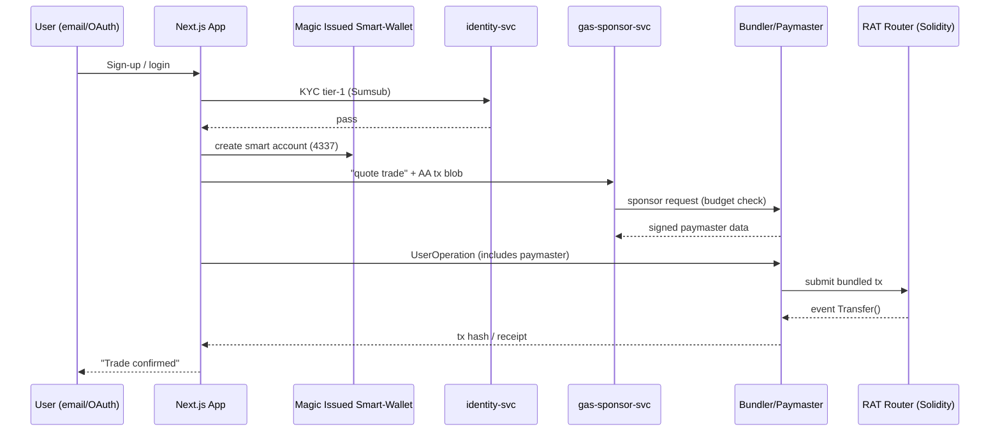

### Wallet-less Onboarding + Gas-Sponsored Trades  
**Proof-of-Concept (PoC) Execution Plan — v0.1 (24 Apr 2025)**  

---

#### 1. Scope & Success Criteria
| Item | Target |
|------|--------|
| **User journey** | Social / e-mail login → instant custodial smart-wallet creation → buy/sell 2 whitelisted RAT pairs (RAT-USDc, RAT-BTC) without touching gas. |
| **Blockchains** | **Sepolia** (Ethereum) for L1 canonical contracts; **Optimism Sepolia** for cheap testing of gas sponsorship (EIP-4337 live). |
| **Tx latency** | ≤ 3 s UX confirmation (bundler mempool + relayer). |
| **Drop-off** | < 15 % between “Sign-Up” → “First Trade”. |
| **Gas cost per trade (sponsor)** | ≤ US $0.03 (90-day average, Optimism testnet oracle). |
| **Security** | Contract passes Mythril static scan, one manual review; PoC infra isolated VPC, no PII outside IAM-scoped KMS. |
| **Reg-fit check** | Custodial flow reviewed by compliance for Seychelles VASP §6 tier-1 KYC. |

---

#### 2. Technical Approach

| Layer | Component | Tech / Rationale |
|-------|-----------|------------------|
| **Identity & Wallet Creation** | **Magic Connect** SDK (email / OAuth) + **ERC-4337 Smart-Account** factory | Proven wallet-less UX; account-abstraction = programmable sponsorship. citeturn0search1turn0search3 |
| **Gas Sponsorship** | **Paymaster** contract (+ trust-bound rules) | Conforms to ERC-4337 paymaster spec; supports per-asset budget caps. |
| **Bundler / Relayer** | **Stackup Bundler** (OSS) running on k8s spot node; fallback to Biconomy SaaS | Mature 4337 implementation; self-host keeps latency in-region (São Paulo). |
| **Forwarder (meta-tx)** | ERC-2771 MinimalForwarder for compatibility with non-AA wallets | Allows dual path if we need classic EOAs. citeturn0search8 |
| **UX Gateway** | Next.js 15 + Wagmi v2 AA hooks; feature flag toggles for custodial / non-custodial | Enables A/B test. |
| **Backend adapters** | Node-TS service:   • `identity-svc` (KYC call-out ↔ Sumsub sandbox)   • `gas-sponsor-svc` (tracks budgets, signs paymaster approvals)   • `trade-svc` (calls RAT DEX router) | Light micro-services; share NATS event bus per guideline #4. |
| **Metrics & Experimentation** | PostHog + Prometheus → Grafana dashboard (`walletless_poc.json`) | Funnels, cost per sponsored tx, latency histogram. |
| **CI/CD** | GitHub Actions → Terraform Cloud workspaces `poc-dev`, `poc-stg` | Mirrors future IaC skeleton #6. |
| **Security** | AWS KMS CMK (São Paulo) for paymaster keys; Secrets pulled via HashiCorp Vault Agent | Aligns with zero-trust guideline #6. |

---

#### 3. High-Level Sequence (Mint Trade)

---

#### 4. Workstream & Timeline

| Week | Deliverable | Owner |
|------|-------------|-------|
| **W 17** | Repo bootstrap (`poc-walletless`) · Terraform baseline · Sample 4337 wallet deployment | DevOps |
| **W 18** | Paymaster contract (unit-tested Hardhat) · Bundler stack in dev | Smart-Contracts |
| **W 19** | Magic login + AA hooks integrated in FE · identity-svc mock ↔ Sumsub sandbox | Frontend / Backend |
| **W 20** | gas-sponsor-svc with Redis budget cache · Prometheus exporter | Backend |
| **W 21** | End-to-end trade path on Optimism-Sepolia; Grafana dashboard; security scan pass | All |
| **W 22** | 50-user closed beta; collect metrics; post-mortem report → decision gate | Product & Arch |

---

#### 5. Cost Projection (6-week PoC)

| Resource | Est. Monthly | Notes |
|----------|--------------|-------|
| AWS São Paulo (EKS dev + RDS t3.small) | **US $950** | spot nodes & reserved DB storage |
| Optimism testnet RPC (Alchemy dev tier) | **Free** | rate-limited |
| Magic Lite MAU 50 | **US $0** | free tier |
| Sumsub Sandbox | **US $0** | 50 checks |
| Misc. (log storage, GH runners) | **US $150** | — |
| **Total** | **≈ US $1 100 / mo** | << 15 k budget |

---

#### 6. Risk & Mitigation

| Risk | Impact | Mitigation |
|------|--------|------------|
| **Bundler outage** | Trades stall | Hot-swap to Biconomy SaaS; health-check & circuit-breaker. |
| **Gas griefing abuse** | Cost spike | Paymaster rule: per-user daily cap; on-chain budget oracle. |
| **KYC privacy leak** | Regulatory | All PII stays off-chain; TLS 1.3; field-level AES-256 at rest. |
| **SDK vendor lock-in** | Long-term | Abstract wallet-provider behind adapter; alt: Web3Auth, Privy. |
| **EIP timeline slips** | Compat | Keep ERC-2771 fallback; monitor Pectra EIP-3074 testnet dates. citeturn0search5 |

---

#### 7. Acceptance Dashboard (Grafana IDs)

| Panel | KPI | Green |
|-------|-----|-------|
| **#101** | Sign-up → Trade funnel completion | > 85 % |
| **#102** | Avg. sponsored gas / trade | < 70 k gas |
| **#103** | Tx success rate | > 99 % |
| **#104** | Latency p95 (UI → receipt) | < 4 s |

---

#### 8. Next Actions (48 h)

1. **Create GitHub repo** `agora-dex/poc-walletless`; add CODEOWNERS.  
2. **Push Terraform skeleton** (`us-east-1` backend bucket, `sa-east-1` cloud).  
3. **Tag @CTO + @Head-of-Compliance** in issue #1 (“PoC Charter”) for sign-off.  
4. **Schedule threat-model session** (Wed 30 Apr 10:00 GMT-3).  

> _All artefacts will live under `/docs/poc-v0.1/` and follow the main architecture style guide._